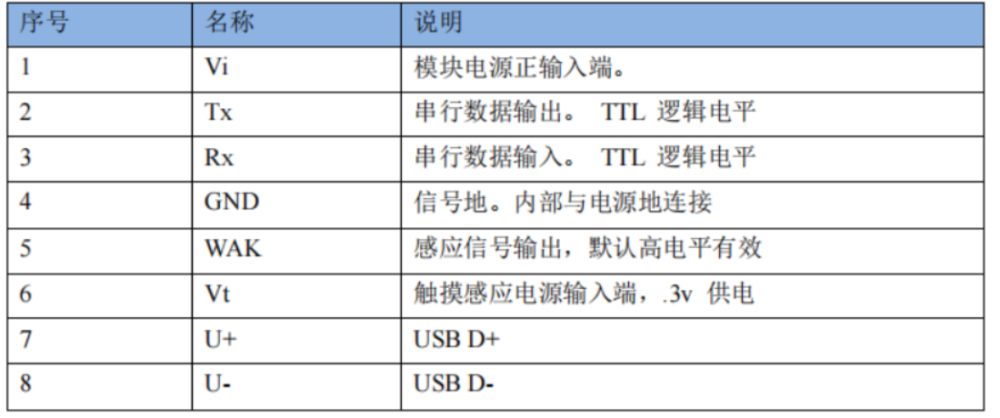
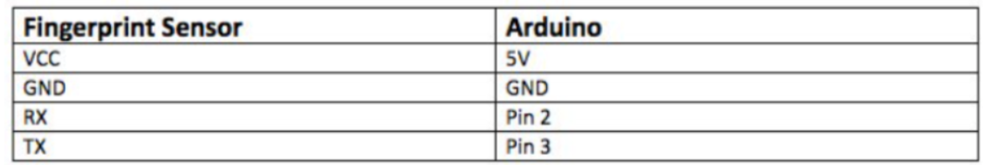
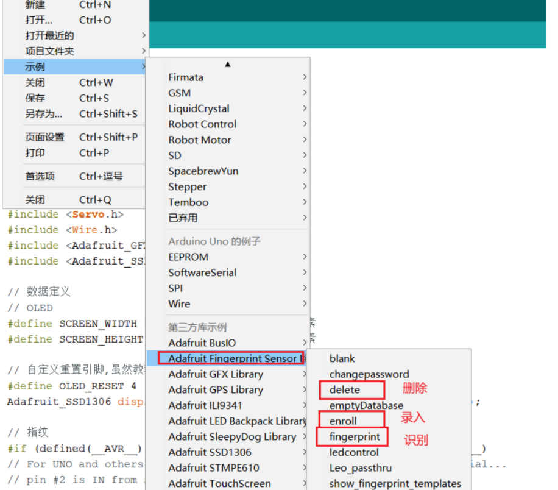

# 指纹识别模块

AS608模块可以用于指纹识别，下面将介绍一下AS608的基本使用。

> 推荐可以查找一些AS608的用户手册进行查阅，里面有更详细的开发信息，不过对Arduino的开发好像没有什么帮助...

## 引脚分布

图为AS608的引脚分布

> 提示：和arduino通信的时候只有四个引脚是有用的，因为AS608和Arduino采用的是软件串口的方式来通信

## 连接方式

图为与Arduino的连接方式

> 如果使用不了可以尝试将RX和TX反接(不反接电源就行)

## 快速上手

在Arduino IDE开发需要安装**Adafruit_Fingerprint**库

在示例中可以直接调用"录入指纹"、"删除指纹"、“识别指纹”三个模块，用户可以根据这三个例程和自己的需求去修改成需要的代码。

图为AS608的例程
