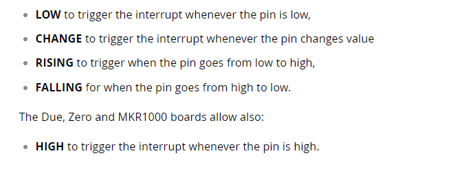
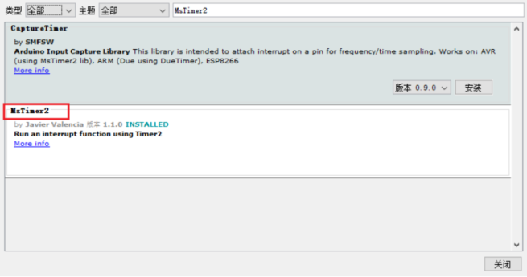

# 定时器 & 中断的使用

**定时器和中断**都是单片机中的重要的功能，使用中断功能可以完成很多更加复杂的控制，而定时器和中断常常搭配在一起使用，本文将通过几个示例程序简单快速的上手定时器和中断。

## 什么是中断？

CPU执行时原本是按程序指令一条一条向下顺序执行的。 但如果此时发生了某一事件B请求CPU迅速去处理（中断发生），CPU暂时中断当前的工作，转去处理事件B（中断响应和中断服务).  待CPU将事件B处理完毕后， 再回到原来被中断的地方继续执行程序（中断返回），这一过程称为中断 。

arduino官方对中断的解释：
> Interrupts are useful for making things happen automatically in microcontroller programs and can help solve timing problems. Good tasks for using an interrupt may include reading a rotary encoder, or monitoring user input.
>
> If you wanted to ensure that a program always caught the pulses from a rotary encoder, so that it never misses a pulse, it would make it very tricky to write a program to do anything else, because the program would need to constantly poll the sensor lines for the encoder, in order to catch pulses when they occurred. Other sensors have a similar interface dynamic too, such as trying to read a sound sensor that is trying to catch a click, or an infrared slot sensor (photo-interrupter) trying to catch a coin drop. In all of these situations, using an interrupt can free the microcontroller to get some other work done while not missing the input.
>
> -----
> 中断对于使事情在微控制器程序中自动发生很有用，并且可以帮助解决定时问题。使用中断的好任务可能包括读取旋转编码器，或者监视用户输入。
> 
> 如果你想确保一个程序总是捕获来自旋转编码器的脉冲，使它永远不会错过一个脉冲，那么写一个程序做任何其他事情都会变得非常棘手，因为程序需要不断地轮询编码器的传感器线，以便在脉冲发生时捕获脉冲。其他传感器也有类似的接口动态，比如试图读取一个声音传感器，它试图捕获一个点击，或者一个红外插槽传感器(照片中断)试图捕获一个硬币。在所有这些情况下，使用中断可以使微控制器在不丢失输入的情况下完成一些其他工作。

在你工作摸鱼的时候**有电话来了**，于是你停下手头正在摸的鱼，**转头去接电话**，等到电话打完了之后，回来继续摸刚才没摸玩的鱼，这就是中断。

电话来了就是**中断的触发信号**，接电话就是**中断要执行的事情（函数）**，打完电话回来继续摸鱼就是中断函数执行完之后**继续执行未执行完的主程序。**

## 中断快速上手

下面我们通过一个简单的demo来快速上手如何使用中断。

demo: 死循环执行+1串口打印程序，当手指触摸2号引脚时，打印一次`finger touch`,手指离开2号引脚的时候，打印一次`finger leave`

```cpp
/**
 * @brief The purpose of this demo is to show how to use interrupt.
 * @author https://github.com/Undertone0809/arduino-uno-dev by zeeland
 * @createTime 2022/11/11 23:24:24
 * @File InterruptDemo.ino
 */

int pinInterrupt = 2; // 接中断信号的引脚
 
void onTouch()
{
  Serial.println("[info] finger touch");   
}

void onLeave()
{
  Serial.println("[info] finger leave");
}
 
void setup()
{
  Serial.begin(9600);
  Serial.println("[info] begin to work");
 
  pinMode( pinInterrupt, INPUT);// 设置管脚为输入
   
  // Enable中断管脚, 中断服务程序为onTouch(), 监视引脚变化
  attachInterrupt(digitalPinToInterrupt(pinInterrupt), onLeave, FALLING);
  attachInterrupt(digitalPinToInterrupt(pinInterrupt), onTouch, RISING);
}
 
void loop()
{
  while(1);
}
```

<p align="center">
    
</p>

事实上，如果你跑过该示例，你会发现实际上2号引脚的触发并不怎么灵敏，以至于它没有办法很好地触发onLeave中断，如果你想要更准确的中断触发效果，那么你不应该拿手测试（狗头）。


对于`attachInterrupt()`这个函数，arduino提供了以下五种中断触发方案,使用者可以根据自己的需求去更换不同的中断触发方案。


## 什么是定时器？

定时器(Timer)就是定时器:dog:，定时器用于设定特定时间触发中断。

Arduino UNO有三个定时器，

- timer0：一个被Arduino的delay(), millis()和micros()使用的8位定时器
- timer1：一个被Arduino的Servo()库使用的16位定时器
- timer2：一个被Arduino的Tone()库使用的8位定时器

Actually，定时器的使用也有多种方式，常见的定时器使用方式有自定义触发、MsTimer2库、TimeOne库三种方式，但事实上，我们不推荐自定义编写定时器触发方式，**如果你想使用操作寄存器这种复杂的方式，你就没必要使用arduino**，所以下面只会MsTimer2和TimeOne两种方式。

## 定时器快速上手

## MsTimer2

MsTimer2封装了Timer2的定时器，因为为第三方库，所以需要先安装MsTimer2库。

<p align="center">
    
</p>

<p align="center"></p>


demo: 每500ms让13引脚的LED灯亮一下。

```cpp
/**
 * @brief The purpose of this demo is to show how to toggle LED on pin 13 each second.
 * @author https://github.com/Undertone0809/arduino-uno-dev by zeeland
 * @createTime 2022/11/11 23:24:24
 * @File TimerInterruptDemo.ino
 */

#include <MsTimer2.h>

void flash() {
  static boolean output = HIGH;
  digitalWrite(13, output);
  output = !output;
}

void setup() {
  pinMode(13, OUTPUT);
  MsTimer2::set(500, flash); // 500ms period
  MsTimer2::start();  // enables the interrupt.
  // MsTimer2::stop();  // disables the interrupt.
}

void loop() {
}

```

## TimerOne

该库使用 timer1 产生自定义载波频率下不同 pwm 占空比输出 和 定时器中断。同样，使用TimerOne时也需要先安装第三方库才能导入。

demo: 在引脚9上设置占空比为50%的PWM输出，并附加一个中断,使LED灯频闪，代码如下：

```cpp
/**
 * @brief The purpose of this demo is to show Sets up PWM output on pin 9 
 *     with a 50% duty cycle, and attaches an interrupt that toggles digital
 *     pin 10 every half second.
 * @author https://github.com/Undertone0809/arduino-uno-dev by zeeland
 * @createTime 2022/11/11 23:24:24
 * @File TimerInterruptDemo2.ino
 */

#include <TimerOne.h>

void callback()
{
    static boolean output = HIGH;
    digitalWrite(13, output);	// 状态翻转
    output = !output;
}

void setup()
{
    pinMode(13, OUTPUT);
    Timer1.initialize(500000); // initialize timer1, and set a 1/2 second period
    Timer1.pwm(9, 512); // setup pwm on pin 9, 50% duty cycle
    Timer1.attachInterrupt(callback); // attaches callback() as a timer overflow interrupt
}

void loop()
{
    
}

```


## 注意事项

1. 如果你使用了 MsTimer2 库， 则 pin11 和 pin3 就不能再用做 PWM 输出了! 因为该 pin3 和 pin11 的 PWM 是靠 timer2 帮忙的! (tone()也是)
2. 注意 Servo.h 库与 TimerOne 都是使用内部定时器 timer1 会影响pin 9, pin 10 的 PWM
3. tone() 使用 timer2 定时器; 若使用 Tone 库的 Tone 对象(Tone 变量)也是优先使用 timer2 定时器，若用两个 Tone 变量则 timer1 也会被用掉， 用三个 Tone 则连控制 millis( )的 timer0 也会被用掉。
4. 别忘了， timer0 负责帮忙控制 pin 5 和 pin 6 的 PWM 输出。只要不去改变 timer 的 Prescaler 就不会影响其控制的 PWM pin， 但MsTimer2 库与 tone( )都会改变 Prescaler。


## 总结

可以看出TimerOne不仅可以完成定时器的功能，也封装了PWM的功能，功能上更加丰富。不过在代码可读性上来说，MsTimer2更具优势，所以可以根据自己的需求选择。更多详细的讲解可以查看源代码或查看References中的[official tutorial](#references).

## References

- [Arduino official tutorial about attachinterrupt()](https://www.arduino.cc/reference/en/language/functions/external-interrupts/attachinterrupt/)

- [Arduino Uno 定时器中断 timer 0,1, 2 （自定义配置、MsTimer2、TimerOne库）](https://blog.csdn.net/qq_19887221/article/details/124820081?ops_request_misc=%257B%2522request%255Fid%2522%253A%2522166815891616782428685319%2522%252C%2522scm%2522%253A%252220140713.130102334.pc%255Fall.%2522%257D&request_id=166815891616782428685319&biz_id=0&utm_medium=distribute.pc_search_result.none-task-blog-2~all~first_rank_ecpm_v1~rank_v31_ecpm-2-124820081-null-null.142^v63^control,201^v3^control_1,213^v2^t3_esquery_v3&utm_term=arduino%E8%87%AA%E5%AE%9A%E4%B9%89%E4%B8%AD%E6%96%AD&spm=1018.2226.3001.4187)

- [Arduino official tutorial about MsTimer2](https://www.arduino.cc/reference/en/libraries/mstimer2/)

- [https://github.com/PaulStoffregen/MsTimer2](https://github.com/PaulStoffregen/MsTimer2)

- [Arduino official tutorial about TimerOne](https://playground.arduino.cc/Code/Timer1/)
